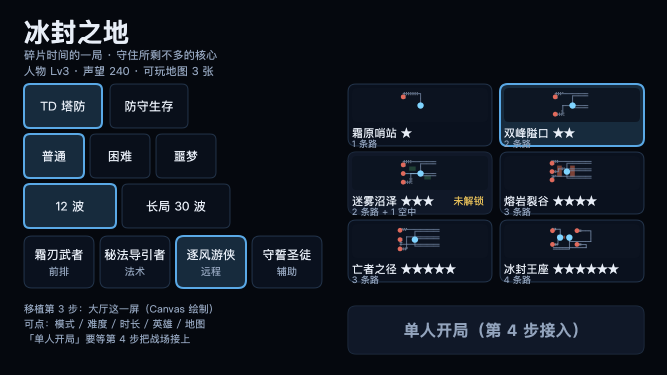
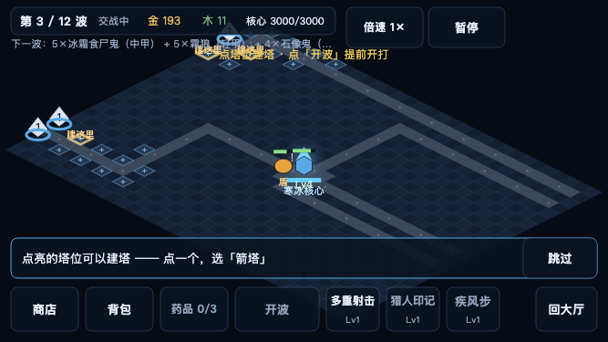
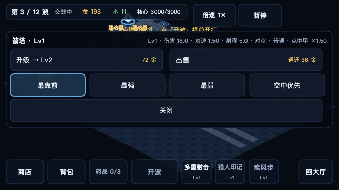
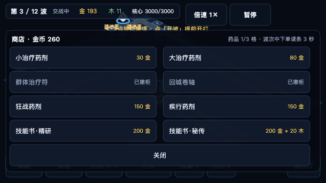
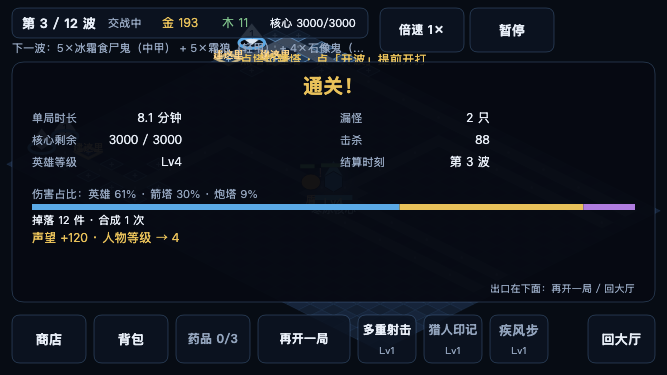
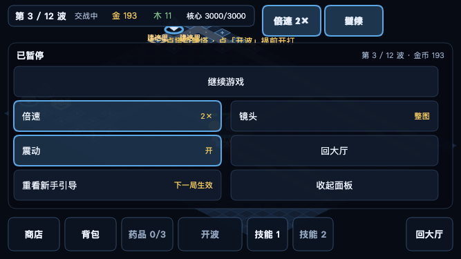
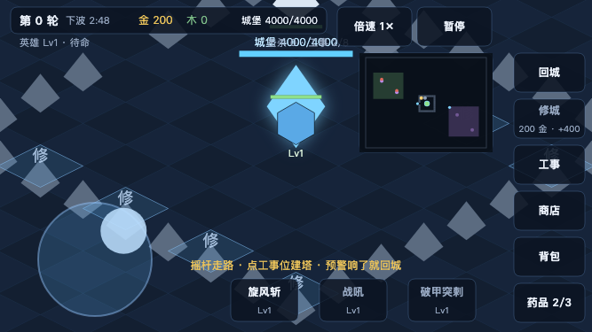

# 微信小游戏移植（M0.5 原型 → 小游戏包）

> 这份文件回答两件事：**现在的代码能不能发布到微信小游戏**，以及**已经做到了哪一步**。
> 数字都能复跑：`npm run minigame`（打包 + 本地验收）、`npm test`、`npm run smoke`。

## 1. 一句话结论

**代码这一层搬完了，但还不能发布**：能不能上线取决于 §6 那几项**非代码门槛**
（小游戏 AppID、小程序备案、类目与资质、联机要的 wss + 已备案域名、真机验收），
以及**真机上的那几项**（帧率 / 内存 / 音频解锁 / 触摸手感 / 安全区）——本地只能跑假 `wx` 的验收。

三步都做完了：平台适配层（§3）、小游戏包与打包器（§4）、界面从 DOM 换到 Canvas（§5，11 个界面 + 相机操作）。
现在小游戏里 **TD 与防守两种模式都能从头玩到结算**，含建造与塔面板、商店与背包、结算与记档、
暂停与倍速与设置、「继续上局」、第一局的引导条，以及拖动 / 双指缩放 / 双击回核心。
浏览器那一侧一行没动（`smoke` 378 条仍全绿），两边共用同一套内核、存档与视图模型。

## 2. 官方规则（核实过的那几条）

网上流传的「小游戏限制」清单里有过时数据，以下是**从官方文档现查**的（2026-09 核对）：

| 项 | 现行规则 | 来源 |
|---|---|---|
| 代码包体积 | **主包 ≤ 4M；主包 + 分包合计 ≤ 30M；单个分包不限制大小** | [代码包](https://developers.weixin.qq.com/minigame/dev/guide/base-ability/code-package.html)、[分包加载](https://developers.weixin.qq.com/minigame/dev/guide/base-ability/subPackage/useSubPackage.html) |
| 网络 | 服务器域名**必须经过 ICP 备案**；`wx.request` / `wx.connectSocket` 的域名要在公众平台后台配成合法域名 | [网络](https://developers.weixin.qq.com/minigame/dev/guide/base-ability/network.html) |
| 上线前置 | 小程序 / 小游戏需要**备案**；类目与资质以公众平台「开放的服务类目」为准（游戏类目涉及主体与经营范围，含内购还要版号等） | [备案指引](https://developers.weixin.qq.com/miniprogram/product/record_guidelines.html)、[开放的服务类目](https://developers.weixin.qq.com/miniprogram/product/material/) |

对照一下社区那份 `weixin-game-skill`（`skill.md` v1.0.0，单 commit，`author: community`）：
它对的地方是无 DOM / `wx.createCanvas` / `wx.setStorageSync` / 全局触摸 / 主包 4MB；
**它过时的地方是「分包合计 20MB、单分包 2MB」**——现行是 30MB / 单分包不限。
另外它没写：`wx.getSystemInfoSync` 已不推荐（用 `wx.getWindowInfo`）、`wx.onShow/onHide` 生命周期、
音频要用户手势后播、域名备案与合法域名白名单。**结论：它当入门检查单可以，当规则不行。**

## 3. 第 1 步（已完成）：平台适配层 `src/platform.js`

把「浏览器专有 API」收进一个文件，业务代码只调这一层；浏览器与小游戏各一套实现，
Node（单元测试）走内存/空实现。**没有能力时一律安静失败**，不让一次点击把界面打断。

| 能力 | 浏览器 | 小游戏 | 谁在用 |
|---|---|---|---|
| 存储 | `localStorage` | `wx.getStorageSync/setStorageSync/removeStorageSync` | `profile.js` / `save.js` / `settings.js` / `net.js` |
| HTTP | `fetch` | `wx.request` | `main.js`（建房那一发） |
| WebSocket | `new WebSocket` | `wx.connectSocket` | `net.js`（统一成 `onOpen/onMessage/onClose/send/close` 一种形状） |
| 音频上下文 | `new AudioContext()` | `wx.createWebAudioContext()` | `audio.js` |
| 视口 / 像素比 | `innerWidth / innerHeight / devicePixelRatio` | `wx.getWindowInfo()` | `render.js` |
| 前后台 | `visibilitychange` + `pagehide` | `wx.onHide` | `main.js`（存档时机） |
| 触觉 | 无（安静跳过） | `wx.vibrateShort` | `feedback.js` |

**没覆盖**：DOM 与指针事件——那是第 3 步，见下。

## 4. 第 2 步（已完成）：小游戏包与打包器

```bash
npm run build:minigame   # 产出 dist/minigame/{game.js,game.json,project.config.json}
npm run minigame         # 先打包再跑本地验收（假 wx）
```

* **打包器**：`tools/build-minigame.mjs`，零依赖。把 ESM 源码按模块图打成一个 `game.js`
  （小游戏跑的是 `game.js` + CommonJS `require`，不是浏览器的 `<script type=module>`）。
  它顺手做两件事：**循环依赖检测**（打完才发现 undefined 就晚了）与**体积报告**。
* **入口**：`src/minigame/game.js`——建立 `selfCheck()`（认出小游戏环境 + 存储往返）与
  `bootSession()`（无头跑一局内核）。第 3 步的渲染循环会挂在这里。
* **配置**：`minigame/game.json`（横屏、关闭状态栏）与 `minigame/project.config.json`
  （`compileType: "game"`，`appid` 留空等你填）。
* **当前主包**：6 个模块（`data` / `core` / `match` / `defense` / `platform` / 入口），
  **约 172 KB**，占 4MB 主包上限的 **4.2%**。界面模块**故意不在里面**（见下一条检查）。

**本地验收**（`npm run minigame`，没有微信开发者工具也能跑）：

1. 假 `wx` 下入口能加载、`selfCheck()` 认出小游戏环境、存储往返成功；
2. **等价性**：同一局（同种子 / 同人数 / 同秒数）用包里的内核跑与用源码跑，`describe()` **逐字段相同**；
3. **主包里没有界面模块**：模块清单里不许出现 `ui/main/render/hud-model/joystick/tutorial`，
   也不许出现 `getElementById` / `querySelector` / `innerHTML` / `classList` 这类界面专用调用。

## 5. 第 3 步（进行中）：界面从 DOM 换到 Canvas

这是**唯一的大头**，也是**发布前的硬阻塞**。官方那套 `minigame-adapter` 只解决 canvas/WebGL/音频等 API，
**不会提供 DOM 与 CSS 布局**，所以：

* 11 个界面（大厅 / TD HUD / 防守 HUD / 商店 / 背包 / 结算 / 设置 / 暂停 / 引导 / 建造轮盘 / 塔面板）
  现在是 HTML + CSS，得改成 Canvas 绘制；
* 连带的还有：**触摸输入**（`pointerdown/move/up` → 全局 `wx.onTouchStart/Move/End`，含双击缩放与双指缩放）、
  **文字排版**（`ctx.fillText` + 自己量宽）、**安全区与胶囊避让**、以及 §1.9.2 那些热区/拇指弧验收线要重新量；
* 现在的 `render.js` 已经是纯 Canvas（只依赖 `canvas.getContext('2d')`），**战场那一块可以原样复用**，
  要重写的是外围的 HUD 与面板。

**建议的做法**：先只做**大厅一屏**，在小游戏里跑起来看观感，确认这条路值不值，再决定另外 10 个界面怎么切。

### 5.1 大厅一屏（已完成 · 2026-09-23）



* `src/minigame/lobby.js`：**纯 Canvas、零 DOM**，写成纯函数——`layoutLobby(w,h,model)` 算布局、
  `drawLobby(ctx,model,L)` 画一帧、`hitTestLobby(L,x,y)` 命中测试、`applyLobbyAction(model,action,档案)`
  改模型（含解锁校验）。于是它能被 Node 用例直接测（记录型 ctx），也能在浏览器里截图看观感。
* 内容与浏览器大厅对齐：模式 / 难度 / 时长 / 英雄 4 张卡 / 地图卡（复用 `render.js` 的俯视缩略图，
  带星级、路线数、「未解锁」标记）/ 档案行（人物等级 · 声望 · 可玩地图数）。
* 布局以 **667×375（§14.3 设计画布）为基准等比缩放并居中**，所以真机 812×375 这类更宽的屏直接居中多留白；
  所有可点元素 **≥44×44**（§1.9.2），并且**避开右上角胶囊区**。
* 输入走 `platform.onTouch`（小游戏 = 全局 `wx.onTouchStart`）。
* **「单人开局」是真的能进局的**（战场见 5.2）。写大厅那一版时它还是灰的、按钮上写着「第 4 步接入」——
  与其摆一个点了没反应的假按钮，不如把这件事写在脸上（口径见 STATUS §3.1 第 2 条：不给玩家假选项）。
* **有存档时右边多一个「继续上局」**（§10.3「随时能停」，见 5.2.5）。

**怎么复跑**：`npm run minigame`（打包 + 假 wx 验收，含「大厅真的画出来了」与「触摸能选中」两条）
· `npm run minigame:preview`（本机 Chrome 出样张，就是上面那张图）· `npm test`（7 条大厅用例：
热区 ≥44、互不重叠、避开胶囊、命中与画法同源、切模式换图、锁图不给选、提示文案不溢出）。

### 5.2 战场（已完成 · 2026-09-23）：大厅点「单人开局」真的能进局



* 战场**直接复用浏览器版的 `render.js`**（它本来就是纯 Canvas）：`createRenderer(canvas, { size })`
  多了一个 `size()` 口子——小游戏的 canvas 没有 `clientWidth/clientHeight`（那不是 DOM）。
* `src/minigame/battle.js`：外面这一圈 HUD（顶部状态条 + 底部动作行）用 Canvas 重画，
  与 `lobby.js` 同一套四件套（布局 / 绘制 / 命中 / 动作）。
* **现在能玩的**：点塔位 → 建造面板选塔种（5.2.1）、点已建的塔 → 塔面板升级/出售/优先级/修塔（5.2.1）、
  底部一排快捷改默认塔种、点「开波」提前开打、点技能键放技能、点「回大厅」退回去；
  结算出来之后「开波」变成「再开一局」。
* **11 个界面都搬完了**：防守那屏见 5.2.6、第一局的引导条见 5.2.7、镜头操作（拖动 / 双指缩放 /
  双击回核心）见 5.2.8。第 3 步到此收口，剩下的都是 §6 那几项非代码门槛。

### 5.2.1 建造与塔面板（已完成 · 2026-09-23）



点空塔位弹**建造面板**（四种塔两列排，买不起的灰掉），点已建的塔弹**塔面板**：

* 读数一行：`Lv2 · 伤害 18.0 · 攻速 1.50 · 射程 5.0 · 对空 · 普通 · 克中甲 ×1.50`（克制提示与浏览器版同一个出口 `attackHint`）；
* **升级**（写着下一级价格，满级写「已满级」）、**出售**（两步确认，显示返还金额）、
  **四档优先级**（最靠前 / 最强 / 最弱 / 空中优先，当前那档高亮）、**修塔**（只在 5★/6★ 攻城图、塔受伤时才出现）、关闭；
* 两处都不给假选项：买不起的塔与满级/买不起的升级按钮都是灰的，点弹层空白处 = 关闭。

**为什么不做轮盘**：浏览器版是「点塔位 → 绕触点画一圈轮盘」，拇指得精确瞄准；小游戏屏更小、手指更粗，
所以先给两步式（点塔位 → 面板里选/操作）。**这是暂定方案**，真机手感确认后如果轮盘更顺手再换——
换的时候这一层的四件套（布局 / 绘制 / 命中 / 动作）不用动。

### 5.2.2 商店与背包（已完成 · 2026-09-23）



底部那排把四个塔种快捷键换成了 **商店 / 背包 / 药品**（建塔改成「点塔位弹面板」之后，塔种快捷键
就成了同一个决定的第二个入口，删掉它让位给真正缺的三个）：

* **商店**：8 件商品两列排（药品 / 增益 / 技能书各带价格，秘传书还带木材），
  **撤柜的两件（群体治疗符、回城卷轴）写在行上**（§3.1 #20 的口径：撤柜也要说清为什么），
  买不起 / 已买满 / 药品格满都会灰掉并写明原因；波次中下单的 3 秒读条进度写在标题里。
* **背包**：已装备 3 格 + 最近掉落（一屏放 6 件，其余在标题里写总数），点一件进**物品详情**——
  穿上 / 强化 +N（带金币）/ 出售（两步确认 + 返还金额，紫装以上带木材加成）；凑够 3 件同部位同品质时
  出现**一键合成**（同样两步确认）。
* **药品键**：底部直接显示 `药品 N/3`，点一下就用（冷却中或没药会说一句）。

返现比例、木材加成、药品格数这些数**都从内核取**（`EQUIP_SELL_REFUND` / `TOWER_SELL_REFUND` /
`EQUIP_SELL_BONUS_LUMBER` / `POTION_BAG_SLOTS`）——第一版我手写了 0.5，而内核是 0.7，
差一点就把「出售返还」写成假数字。

### 5.2.3 结算面板 + 记档（已完成 · 2026-09-23）



* 内容**直接复用浏览器版的 `resultPanelModel`**（`hud-model.js`）：结果行（时长 / 漏怪 / 核心剩余 /
  击杀 / 英雄等级 / 结算时刻）、伤害占比（带一条按占比切色的横条）、掉落与合成、声望与人物等级——
  一份视图模型两个渲染器，省得两边各写一套「本局数据」（§151 那条口径：同一个面板不能两种说法）。
* 出口在底部那排（「开波」在结算时自动变「再开一局」），面板右下角写着这件事。
* **这一屏顺手补了一个更重要的洞**：小游戏以前**打完一局不记档**——声望、人物等级、地图解锁全都纹丝不动，
  而大厅那行「人物 Lv / 声望 / 可玩地图」又是从档案读的（一个永远不动的数字比不摆更糟）。
  现在一局结束就记一次档（§188 的规矩：一局只记一次），并把新档案用于下一次开局；
  同时把 §3.6 的人物等级便利（初始金币 + 复活加速）接进小游戏的开局参数——
  以前这两项在小游戏里**根本没生效**（开局永远是裸的 200 金、复活永远 15 秒）。

### 5.3 复跑

```bash
npm run minigame          # 打包 + 假 wx 验收（含「大厅画出来了 / 触摸能选中」6 条）
npm run minigame:preview  # 出八张样张（大厅 / 战场 / 塔 / 商店 / 结算 / 暂停 / 防守 / 英雄详情）
npm test                  # 331 项：小游戏这一层的大厅 / 战场 / 建造 / 商店 / 结算 / 暂停 / 继续上局 / 防守 / 新手引导 / 相机
```

## 6. 发布前还差什么（非代码，都要你那边办）

| 项 | 谁来做 | 说明 |
|---|---|---|
| 小游戏 AppID | 你 | 填进 `minigame/project.config.json` 的 `appid` |
| 小程序备案 | 你 | 官方备案指引（上面链接） |
| 类目与资质 | 你 | 公众平台「开放的服务类目」；游戏类目涉及主体与经营范围，含内购涉及版号 |
| 联机服务器 | 你（部署） | 要 **wss + 已备案域名**，并在后台配成 socket 合法域名；现在的 `ws://127.0.0.1` 只在本机开发用 |
| 真机验收 | 你（微信开发者工具 + 真机） | 帧率 / 内存 / 音频解锁 / 触摸手感 / 安全区，本地没有真机与开发者工具 |

**注意**：小游戏这一版是**单机**的——联机那一层（`net.js` / 房间 / 快速匹配）没有进主包，
大厅里也不给联机入口（不给点了没反应的假选项）。所以「联机服务器」这一项**等真要接联机时再办**，
不影响现在发布一个单机版。

### 6.1 你那边怎么跑起来（一步一步）

1. 装 **微信开发者工具**（官方下载页搜「微信开发者工具 稳定版」），用**能开发小游戏的微信号**登录；
2. 公众平台注册**小游戏**账号 → 拿到 **AppID** → 填进 `minigame/project.config.json` 的 `appid`
   （这是**源文件**；`npm run minigame` 会把它与 `game.json` 原样拷进 `dist/minigame/`，所以改这里就够了）；
3. 先在仓库根目录跑一次 `npm run minigame`（产出 `dist/minigame/`），
   然后在开发者工具里 **导入项目** → 目录选 **`dist/minigame/`**（`minigame/` 只有配置、没有 `game.js`，
   不能直接导入）→ 类型选「小游戏」；
4. 先点 **编译**：大厅应该直接出来（标题「冰封之地」+ 模式/难度/英雄/地图四排）。点「单人开局」进局，
   点塔位建塔、点「开波」、点技能；暂停面板里能切倍速 / 镜头 / 震动；打完一局看结算与档案是否 +声望；
5. 切「防守生存」再开一局：左下拖动 = 摇杆走路，点战场 = 走过去，点工事位（「修」字）= 建工事，
   顶部有轮次与预警倒计时；
6. **真机预览**（工具栏「预览」扫码）：重点看四件事——
   帧率是否稳（长局 30 波最容易掉）、内存是否一路涨（连打两三局看开发者工具的「性能」面板）、
   **有无声音**（防守的预警：小地图闪 + 两声蜂鸣；没有就说明音频没解锁——§178 那条，本地验不了）、
   触摸手感（摇杆跟手、拖动地图、双指缩放、点塔位不要求点得准）、
   安全区与右上角胶囊（HUD 有没有被刘海或胶囊压住）；
7. 反向也要试一次：**竖屏**打开应看到「请横屏玩」、很小的小窗应看到「屏幕太小」——
   这两条是本地能验、真机也要确认一遍的兜底（代码见 §5.2.9）。

真机上发现的具体问题（哪一屏、什么操作、什么表现）直接开一个 issue 或者告诉我，我按验证记录那套
（先复现 → 一个能失败的检查 → 再改）接着修。

### 6.2 这一版**有意**留着的差距（不是漏，是没做）

| 差距 | 现在是什么 | 要补的话 |
|---|---|---|
| **音效只有预警两声** | 接上了 `audio.js`（§2.6 的回防预警：小地图闪 + 两声蜂鸣，走 `wx.createWebAudioContext`，每次触摸顺手解锁——§178 那套）。但**只有这一声**：没有按键音、没有开波音、没有结算音（浏览器版也只有这一声） | 要更多音效是另一件事；本地只能用假 `wx` 验到「预警起了就排两声蜂鸣、静音时一声不排」，**听不听得见要真机验收** |
| **小屏不做紧凑排布** | 比 667×375 小就明说「屏幕太小」（与浏览器侧 STATUS §3.1 #33 同一条口径） | 真要支持 iPhone SE 一代那类机型，得另开一件「紧凑排布」（浏览器版当年是 §161 做的） |
| **联机** | 没进主包，大厅也不给联机入口（单机版） | 联机那一层要 **wss + 已备案域名**，等这块办下来再接 |
| **分享 / 排行榜** | 没做 | 依赖小游戏环境的分享卡片与服务端榜单 |
| **快速复活在小游戏里多了一颗按钮** | 浏览器版这条只有键盘 `r`（§7.6 的实现是快捷键），手机上够不着；小游戏补了「快速复活 · 50 木」按钮 | 要在浏览器版对齐的话，是把那颗按钮也加到操作行里（那边是手机浏览器时同样够不着） |
| **没有日志面板** | 浏览器版有一块可滚动的日志（内核那些 `addLog` 的去处）。小游戏用**转瞬即逝的提示行 + 结算面板**代替：屏幕就这么大，摆一块常驻面板要吃掉战场 | 真机确认「看不到日志会漏什么」之后再决定：要么加一块可折叠的，要么把内核日志里真正要紧的那几条（如「通关！进入无尽」）挑出来做成提示 |

## 7. 现在能跑通的命令

```bash
npm run minigame          # 打包 + 假 wx 本地验收（6 条：环境自检 / 内核等价性 / 模块清单 / 大厅画出来了 / 触摸能选中 / 点开局能进局）
npm run minigame:preview  # 本机 Chrome 出八张样张（docs/testing/screenshots/minigame-*.png）
npm test                  # 331 项，含小游戏这几屏的布局 / 命中 / 状态迁移 / 记档
npm run smoke             # 378 条真浏览器断言（浏览器那一侧的界面仍然按浏览器验）
```

### 5.2.4 暂停 + 倍速 + 设置（已完成 · 2026-09-23）



顶栏右侧多了 **倍速** 与 **暂停** 两个键（位置避开右上角胶囊区，高度 44pt）：

* **暂停**：单机局**真暂停**（帧循环一步都不推内核，画面照旧画）。联机「不假装暂停」那条口径（§114）等联机接进来时再按模式区分。
* **暂停面板**里三项开关**都真的接着东西**，不是摆样子：
  倍速（1× / 2×，帧循环按倍数推内核）、镜头（`settings.tdFitAll`：整图可见 / 以核心为中心放大到 `settings.zoom`，与浏览器版同一份设置）、
  震动（`settings.sfx` 经 `feedback.js` 的 `wx.vibrateShort`——小游戏这次真的把短震动接上了）。
* **当时没摆的两项，后来都补上了**：`effects` 见 §5.2.22（低特效档真的关掉脉冲，且 §10.7 的内存告警
  会自动切到这一档）；提示音见 §5.2.20（防守的回防预警两声蜂鸣）。当初不摆是对的——
  那时摆了确实是假选项，现在两样都有东西可接。

顺带修了一处「加了按钮忘了收顶栏」的排版问题：倍速键一开始压住了顶栏的「核心 3000/3000」，
样张里一眼可见；现在顶栏收窄到 x=368、里面几格的间距跟着重排，并有用例盯着「按钮不压顶栏、不压胶囊区」。

### 5.2.5 「继续上局」（已完成 · 2026-09-23）

§10.3 的「随时能停」在浏览器版是**每 5 秒自动存档 + 切后台补一笔 + 大厅给一个「继续上局」**。
存档本身（`save.js` 的序列化 / 反序列化 / 「读得出来才算有」）早就走平台适配层了，缺的是小游戏这条路径上的**三处接线**：

| 接线 | 在哪 | 为什么以前漏了 |
|---|---|---|
| 每 5 秒自动存 | `tick()` 里 `maybeAutosave()`（累计 5 秒存一次，结算中的局不存） | 这一整套原来只在 `main.js` 里 |
| 切后台补一笔 | `platform.onHide` → `saveToStorage()` | 小游戏是 `wx.onHide`，浏览器是 `visibilitychange + pagehide` |
| 大厅「继续上局」 | 有存档时右边多一个按钮（挤掉「单人开局」的宽度，两个都 ≥44） | 大厅这一屏是从零重画的，没有继承浏览器版那个按钮 |

两处**故意对齐浏览器版**的口径：**一局结束就收掉存档**（不然大厅会出现「继续上局」→ 点进去是刚打完的那局）、
**回大厅 = 主动放弃这一局**（同样收掉存档）。存档读不出来时（版本/形状对不上）**不留一个点了没反应的按钮**：
清掉它并说一句（§204 的口径）。

**验收**：`tests/minigame-resume.test.js` 三件——大厅布局（有/没有存档两种宽度、热区、不越界）、
点「继续上局」只表达意图、以及一条**真闭环**：跑 6 秒（自动存档）→ 切后台补一笔 →
把包复制成新文件名重新 require（模拟「关掉再打开」，ESM 缓存按路径走，不换名就还是同一个实例）→
大厅出现「继续上局」→ 点进去时间接着上一局 → 打完这局存档自动收掉、大厅不再给入口。

### 5.2.6 防守那一屏（已完成 · 2026-09-23）：跟随相机 + 摇杆 + 轮次 HUD



以前大厅切到防守时，「单人开局」给的是「还没接过来」的理由（而不是开一局 TD 糊弄）。这一屏把它接上了：

* `src/minigame/defense-screen.js`：**纯 Canvas、零 DOM**，仍然是四件套——`layoutDefense` / `drawDefenseHud` /
  `hitTestDefense` / 摇杆数学（`stickBase` / `inStickZone` / `stickVector`）。战场依旧复用 `render.js`
  里那个 `drawDefense`（它自己算跟随相机，我们只把 `scale` 递进去）。
* **防守与 TD 的三处不同**，正是这个模式的三条设计约束：相机**跟人走**；操作是**虚拟摇杆**（左侧 45% 起手，
  §1.9.1）而不是点选建造；HUD 换成**轮次 / 城堡血 / 预警倒计时**（TD 那套波次条在这里没有意义，§115 同一口径）。
* **操作语义与浏览器版对齐**：推杆 = 持续走（同一条移动指令只在**换格时重发**，不每帧重算 A*）；
  松手时位移 < 12pt 的那一下当**点地移动**（§1.9.1 的「轻点也走一步」）。
* **工事**：战场上点空工事位（画着「修」字）→ 工事面板两种（箭塔 / 墙，买不起灰掉）。防守商店里的
  「修城」「回城」也在这排键上（冷却中/阵亡时灰掉，点了会说一句为什么）。

**这一屏冒烟时抓出来的四个坑**（都留了用例或注释，免得下次重踩）：

| 坑 | 现象 | 根因 |
|---|---|---|
| 两处动作出口 | 防守的暂停/倍速点了没反应 | HUD 动作写在 `tapBattle` 的 switch 里、弹层动作写在另一个函数，防守把命中接到「弹层动作」上 → 合成**一个 `applyAction`**，所有入口都走它 |
| `sheetFor` 没兜防守 | 工事面板建不出来 | 直接调 `layoutSheet` 对 `fort` 返回 `null`，于是点哪儿都算「关弹层」 |
| 摇杆底座传入错形状 | 推杆推不动（底座坐标 NaN） | `stickBase` 要 `{w,h}`，而 `size` 是视口形状 `{width,height,dpr}` |
| 城堡血量画两遍 | 顶栏那行与 `drawDefense` 自带的血条**叠字** | 相机跟人时城堡多半就在画面中上部；现在城堡血量只写在顶栏右端（固定可见） |

**验收**：`tests/minigame-defense.test.js` 四条——摇杆数学（死区 / 夹紧 / 方向）、HUD 布局（热区 ≥44、
不压胶囊区、摇杆区与 HUD 键不重叠）、**摇杆真的推着人物换了格**、以及「点空工事位开面板 → 选中一种 → 真建出来」。
样张第 7 张 `minigame-defense.png` 顺手加了**空图自动报错**：页面里一抛错 headless 只会给一张黑图，
`minigame-preview.mjs` 现在会对 < 3KB 的产物回读标题并把错误打出来。

（**这一屏当时列的三个小项，后来都清了**：浮动摇杆开关见 5.2.10；防守结算面板的文案**本来就是共用的**
——小游戏画的就是 `resultPanelModel` 的防守分支，5.2.10 顺手补了一条断言把它钉住；
`bestRounds` 战绩在大厅那一行里读的是档案，属于浏览器版的既有口径，小游戏不另外画。）

### 5.2.7 新手引导条（已完成 · 2026-09-23）：第一局进 TD 就有人带


引导那四步（建塔 → 提前开波 → 旋风斩 → 撑住一波）的**状态机就是浏览器版那一份** `src/tutorial.js`——
它本来就没有 DOM，所以小游戏这边一行都没抄，只重画了那条提示条：

* `battle.js` 里多一节：条画在底排上方，**条本身不吃触摸**（浏览器版靠 `.hud` 的 `pointer-events: none`
  做到同一件事），只有「跳过」那颗键接触摸 —— 于是它盖在战场上也不挡点塔位。
* 战场上那三个「建这里」的圈是**复用 `render.js` 的 `hintSlots`**（本来就有这段绘制，只要把
  `tutorial.hintSlotCount()` 递进 `renderer.draw` 即可）。
* 四处接线与浏览器版逐条对齐：`build` 成功 → `onTowerBuilt`、`skill` 成功 → `onSkillCast`、
  波次变化 → `onWaveStarted` / `onWaveCleared`；收尾**只认 `tutorial.done`**，收尾时把「已看过」写档案、
  并用 `tutorialPasses` 说一句「达标 / 超标」（§1.8 的两条验收线：建塔 ≤90s、首波 ≤180s）。
* **门槛只在第一局的 TD**：防守局压根不挂（那四步全是塔防的），与浏览器版是同一条控制流。
  暂停面板里多一格**「重看新手引导」**——「重看」就是 §153 那个口径：把 `tutorialDone` 置回 false，
  下一局再挂上（浏览器版在设置面板里是同一个动作）。

**验收**：`tests/minigame-tutorial.test.js` 四条——布局与触摸口径（条穿透、跳过键 ≥44、不压底排与胶囊区）、
**一条真闭环**（第一局挂上 → 建塔换第二句 → 开波换第三句 → 放技能换第四句 → 清掉第一波后自动收尾 + 记档 +
第二局不再挂）、跳过与「防守不挂」、以及「重看之后下一局真的重新挂」。
三条接线各自做过**变异反证**（拿掉门槛 / 拿掉建塔那一钩 / 拿掉 `hintSlots`，对应用例都会红）。

**顺带改了检查里的一处口径**：`minigame-bundle` 与 `minigame-smoke` 以前把 `tutorial.js` 归在
「不许进主包的 DOM 界面」那一类里，其实它是**纯逻辑**（正因为纯逻辑才能被两边共用）——
现在那一类只剩 `ui.js` / `main.js` / `joystick.js`，并且**反过来钉了一条**：
主包里必须有 `tutorial.js`（不然就是有人在小游戏里抄了第二份）。

### 5.2.8 拖动、双指缩放、双击回核心（已完成 · 2026-09-23）：第 3 步收口

§2.5 / §171 的镜头三条：**单指拖空白处平移、双指缩放到局部、双击回核心**。浏览器版在 `main.js` 里靠
canvas 的 pointer 事件（`pointers` / `pinchDist` / `lastEmptyTap` 三个变量）；小游戏没有 DOM 事件，
只有 wx 的全局触摸，而且**一次只给 `changedTouches`**，所以这一层的活是「自己把触点表攒起来」：

| 事 | 怎么做的（与浏览器版对齐的口径） |
|---|---|
| 单指平移 | 放大档（`settings.tdFitAll === false`）下的**空白处**才武装拖动——整图档本来就没有可拖的余地；松手没动才算「点」 |
| 双指缩放 | 两指间距变化 → `renderer.zoomAt(next, 中点)`（和桌面滚轮同一个出口），范围 0.4–2.2；从整图档一捏就自动切到放大档并记住 |
| 双击回核心 | 两次「点空白处」在 300ms / 30px 内 → `backToCore()`（整图档下就等于重新 fit，放大档下回核心） |
| 防守模式 | 一条都不接——防守是跟随相机（每帧被 `drawDefense` 覆盖），这是浏览器版同一个判据 |

**这一屏踩的坑值得记**（都是「点了/拖了之后反应不对」这类只能靠跑起来发现的）：

1. **一次触摸被拆成两次点击**：小游戏只有 `down/move/up`，「按下就响应」的老写法让**松手那一笔又点了一次**。
   第一版里这个 bug 的表现很具体——在空白处按下、手指滑到塔位旁边松手，松手那一下会**顺手弹出一张建造面板**。
   改法：触点表里带一个 `tapped` 标记，按下处理过就标上，松手不再补点。
2. **标记被移动事件弄丢了**：`pointers.set(id, { x, y })` 写成了换一个新对象，于是**拖一下就丢标记**，
   上面那个 bug 只在「拖动过」的手势里复现（原地按一下反而正常）。改法：移动只改坐标，别换对象。
3. **双指抬起时补点**：缩放完松手会趁机弹面板。改法：这一下本来是双指（`pinched`）就什么都不点。
4. 缩放要**能在面板开着时用**（玩家会一边看面板一边把镜头拉远），所以它和「拖动 / 点」不能共用
   「弹层是否打开」这一个判据——这条拆开之后才符合浏览器版的行为。

**验收**：`tests/minigame-camera.test.js` 三条——双指缩放（张开放大、以两指中点为锚点、从整图切到放大档、
松手不弹面板）、放大档拖 80 像素地图跟着走 / 整图档拖不动（同一条判据）、双击空白回核心
（并把核心真的放到屏幕中心；两次落点离得远时不当成双击）。其中「松手落在塔位旁边不该弹面板」
与「双指张开该放大」两条做过**变异反证**（把移动事件换回新对象、拿掉 `zoomAt`，对应用例都会红）。
假 `wx` 也跟着改了：`fireTouch(x, y, type, id)` 多一个触点编号（默认还是 0，老用例不用改），双指才有两个 id。

### 5.2.9 视口门槛与大屏居中（已完成 · 2026-09-23）：把「最小支持视口」这条拍板也搬过来

STATUS §3.1 #33 拍板过一件事：**最小支持视口 = 667×375**，比它小就明说（浏览器侧是两条 `@media`
——竖屏「请横屏」、太小「屏幕太小」），而不是把界面挤成一团。小游戏这边以前**一条都没有**：
竖屏运行时会照着设计画布把 HUD 画到 375 宽的画布上（右半边的东西全在屏幕外），568×320 的老机型同理。

* **竖屏 / 太小**：只画那一句说明（按宽度折行——竖屏时那句话比屏幕还宽），期间**不接任何触摸**。
  门槛与浏览器侧同一套数字（宽 < 640 或高 < 359 就算太小）。
* **屏幕比设计画布大**（如 812×375）：战场 HUD 按设计单位**居中**——只平移不缩放，
  缩放会把 §1.9.2 那批 44pt 热区一起改小。触摸坐标减掉同一个偏移，所以「画在哪」与「点在哪」仍然同源。
* 大厅那一屏本来就按视口缩放布局（`layoutLobby`），不受影响；受影响的只有战场 HUD 那一层。

**验收**：`tests/minigame-viewport.test.js` 三条——竖屏（画「请横屏」、不画大厅、触摸不生效）、
568×320（画「屏幕太小」、触摸不生效）、812×375（HUD 居中：不偏移的那一下落在「倍速」上、
加上 72.5 的偏移才是「暂停」）。后两条各做过**变异反证**（拿掉触摸偏移、拿掉竖屏那一句，用例都会红）。

### 5.2.10 防守的设置与暂停面板（已完成 · 2026-09-23）：三个「按了没用 / 写了假话 / 直接崩」的坑

清尾时按「换环境会漏掉什么」又过了一遍防守那屏，抓到三个：

1. **防守局一按暂停就崩**（真崩溃，不是观感问题）。暂停面板的提示行写的是 TD 的 `m.wave.index`，
   而防守局压根没有 `m.wave`——异常从帧循环里冒出去，画面就冻在那一帧。原来的用例没抓到，是因为它
   只 `tick()` 不 `drawFrame()`（面板要画出来才会走到那一行）。改法：按模式取读数（防守写「第 N 轮」）。
2. **设置面板摆了个按了没反应的假选项**（§154 的原话）。防守是跟随相机，「镜头：整图 / 放大」改了也没用；
   反过来「摇杆：固定 / 浮动」是防守专用的。现在两边各占同一个格：TD 摆镜头、防守摆摇杆。
3. **暂停面板的读数是写死的**。它一直传 `layoutSheet(m, b.ui)`，而 `b.ui` 只有 `{ sheetKind: 'pause' }`——
   于是跑着 2× 的面板写着「1×」、关了震动的写着「开」。改法：弹层从闭包里的活状态取读数
   （`rate` 与 `settings`）。§151 那条「一个面板不能两种说法」在读数上同样成立。

顺带把**浮动摇杆**补上了（§1.9.3 的「固定 / 浮动」）：固定 = 左下那个底座不动（有效区左下 45%），
浮动 = 手指按哪儿底座跟到哪儿（有效区放宽到左半屏）——与浏览器版 `joystick.js` 同一套规则，
两者都只吃**下半屏**（上半屏是地图与 HUD）。

**验收**：`tests/minigame-defense.test.js` 补两条 / 改一条——防守按暂停后 `drawFrame()` 不再抛
（并断言面板写「第 N 轮」、有「摇杆」、没有「镜头」）、切浮动之后左半屏按下即摇杆且底座跟手指
（同一位置在固定档下只是「点地移动」）、暂停面板的三处读数跟着活状态走。
其中「防守暂停」与「读数」两条做过**变异反证**（把模式判断写死成 `false`、把弹层退回传 `b.ui`，用例都会红）。

### 5.2.11 商店的「为什么买不了」（已完成 · 2026-09-23）：同一句判断别写两遍

小游戏的商店面板**自己重算了一遍**「这件能不能买」（逐件比 `shopBlocked` / `shopBought` / 药品格 / 金币），
而浏览器版用的是 `hud-model.js` 的 `shopRows`。两份判断的差集就是漏掉的东西：

* **§3.1 #14「回基地再买」**：防守局的商店在基地里（内核靠 `m.shopNear` 判定）。小游戏那版不认这一条——
  人跑远了，那一行看着能点，点下去内核拒绝，提示还写着「买不了（金币不足 / 已买满 / 药品格已满）」，
  **真正的原因一个字都没提**；
* **木材**：秘传书要 20 木材，小游戏那版只比金币——同样要点了才知道。

改法是**别再写第二遍**：逐件商品的状态直接取 `shopRows(m, priceOf)`，行上的原因（已撤柜 / 已买满 /
药品格已满 / 回基地再买）与禁用条件都由它算；顺带在标题下写明「商店在基地里」。
买不了时的提示也改成**行上那句原因原样说**——同一件事只有一处表述，就不会再出现「行上写回基地、提示写没钱」。

**验收**：`tests/minigame-battle.test.js` 的商店用例补两条——木材不够时秘传书要灰（补上木材恢复可点）；
防守局人物走出 `shopNear` 半径后那一行是「回基地再买」、提示里有「商店在基地里」、走回去就恢复可点
（并且内核也真的卖给你）。「回基地再买」那一条做过**变异反证**（把这条分支删掉，用例当场红）。

### 5.2.12 兜底：两种模式里「每一颗键都按一遍」（已完成 · 2026-09-23）

前面这几屏是靠手写用例一条条钉的，而「防守一按暂停就崩」那个坑说明**手写总会漏路径**。
于是补了一条兜底的：进局之后把 HUD 上的每一颗键、每张弹层里的每一行**都点一遍**，每点一下都画一帧——
不查观感与数值，只钉底线「没有一条路能把画面弄崩」。它自己就抓过东西：把暂停那个修复还原，
这条用例立刻红（`TypeError: reading 'index'`）。

见 `tests/minigame-tapall.test.js`（2 条：TD + 防守）。

### 5.2.13 「继续上局」也接上防守局（已完成 · 2026-09-23）

顺着兜底那条思路又查了别的入口，找到「继续上局」那一处：它和「开一局」本该是同一件事，代码里却是两份，
副本少了两样东西——**按 TD 的形状读 `m.wave`**（防守局没有 `wave`，所以续一个防守档一进屏就抛异常）、
以及**没有 `sheetOf`**（§226 那一轮新加的，副本没跟上，续档之后点开面板再点里面就会抛）。
防守局每 5 秒也在自动存档，所以「续一个防守档」这条路上真会走到。

改法是把「把一局装进战场」合并成**一个**构建口（`buildBattle`），开局与续档都走它。
验收见 `tests/minigame-resume.test.js` 新增的两条：续档之后面板里的行要真的能用、
防守局的存档续回来还是防守那一屏（回城 / 城堡 / 第 N 轮）。两条各做过变异反证。

### 5.2.14 两个功能缺口（已完成 · 2026-09-23）：买了书用不了、上次的配置记不住

清尾时拿「浏览器版有、小游戏这边有没有」逐条对，补上两个：

* **第三颗技能键**：商店里卖的那本「技能书·秘传」会把第三个技能解锁，而小游戏的底部那排
  **写死了两颗**「技能 1 / 技能 2」——**买了书等于白买**，界面上一个字都没提（比不卖还糟）。
  现在按内核给的技能表画（`hero.def.skills` + `thirdSkill`），名字、等级、冷却全部走内核那一个出口
  （`skillLevel(m, def)`，与浏览器版 `ui.js` 的 `renderSkills` 同一套）：键上写技能名，
  下面一行写 `Lv1` 或冷却秒数，没解锁/冷却中一律灰掉。浏览器版一开始就摆着那颗灰键，现在也一样——
  玩家能看见「有这么个技能，书能解锁它」。
* **上次配置一键开局**（§2.1）：浏览器版把上一局用的模式 / 地图 / 难度 / 英雄 / 时长记进档案，
  下次打开照着选。小游戏以前从来不记，于是「上次选了噩梦难度」重开就回到普通。
  现在开局时记一笔，大厅读回来；读之前过 `normalizeChoice`（§177 那道边界：跨版本的脏值不许把大厅带崩），
  并且**上次那张图这号人物没解锁时只落回地图、其余照旧沿用**。

**验收**：`tests/minigame-battle.test.js` 加两条（布局：三颗键的名字 / `Lv` / 冷却秒数 / 灰态 / 不压「回大厅」；
闭环：法师开局 → 买书 → 第三颗键从灰变亮 → 点下去真的放出来进 40 秒冷却）、
`tests/minigame-lobby.test.js` 加一条（沿用 / 图没解锁只落回图 / 跨版本脏值一律默认）。各做过变异反证。
样张里战场那张现在能看到三颗带名字的键（多重射击 / 猎人印记 / 疾风步，最后一颗是灰的）。

### 5.2.15 转无尽之后的出口（已完成 · 2026-09-23）：小游戏以前**玩不到无尽**

§12.5 把无尽写成「排行榜口径」（守住 4 轮之后按城堡剩余血量排行，§131 / §190）。浏览器版那条路是：
守住 4 轮 → 内核 `checkDefenseWin` 把 `assault.endless` 打开、`result = 'win'` → 结算面板上多一颗
**「继续（无尽）」**（`btnEndless`）→ 点了 `view.resultDismissed = true`，面板收起来、那一局继续跑
（帧循环里那句 `canPlayOn = !match.result || !!match.assault?.endless`）。

小游戏这边缺的正是后半段：**`tick()` 一见 `m.result` 就返回 0**，于是守住 4 轮之后画面冻在结算那一刻，
无尽一秒钟都玩不到——而那正是这个模式的最长玩法。现在：

* `tick()` 的判据改成 `paused || (result && !assault.endless)`（"城堡陷落"那种彻底结束由内核 `m.over` 挡）；
* 转无尽时给一颗底排键**「继续（无尽）」**（防守本来没有底排，y=315 与结算面板底边 302 不重叠），
  点了就 `resultDismissed = true`：面板收起来、键也跟着收起来，那一局接着跑；
* 结算面板右下角那句出口提示按模式说（防守的底排没有「再开一局」，它的出口是暂停面板里的「回大厅」）。

**验收**：`tests/minigame-defense.test.js` 加一条——摆出「刚守住 4 轮」的状态（真打满 4 轮要十几分钟）：
时间要继续走 → 面板还在时给「继续（无尽）」→ 点了之后键收起来、那一局还在跑 →
反面：把 endless 关掉（城堡陷落那种结束）时间必须停。两条变异反证（退回 `result` 就停表、拿掉那颗键）都红。

### 5.2.16 防守的小地图（已完成 · 2026-09-23）：跟随相机下唯一的全局视图

§2.6 / §14.3 稿 5 的小地图在浏览器版是防守模式的必需品：**相机跟着人走时，你看不见基地在哪、
怪从哪个方向来**——那张俯视图是唯一的全局视图，点它还回城（与「回城」按钮共用 30 秒冷却）。
小游戏这边一直没有它，玩家只能靠一条 `⚠ Ns 后抵达` 的倒计时猜方向。

接法沿用移植里已经定型的那条路（**渲染逻辑一行不重写，只补一个尺寸口子**）：

* `render.js` 的 `createMinimap(canvas, { size })` 与 `createRenderer` 一样多一个 `size()` 口子——
  小游戏那张是**离屏 canvas**，同样没有 `clientWidth/clientHeight`；浏览器不传，行为不变；
* 小游戏里**第二张 `wx.createCanvas()` 就是离屏画布**：把那套绘制画在上面，再整块 `drawImage` 贴到主画布；
* 位置挑在右侧那排按钮左边、倍速/暂停下面（`405,60` 起 150×112），那一格也在 `L.items` 里，
  动作就是 `{ type: 'teleport' }`——点小地图回城，与那颗按钮同一个出口；
* 顺手挪了一处排版：防守的提示那一行从 y=66 挪到**底部中间 y=300**。它原来夹在
  `drawDefense` 自己画的「城堡 x/y」与小地图中间，样张里看得见半句话被切掉。

**验收**：`tests/minigame-defense.test.js` 两条——布局（小地图 ≥44、不压胶囊/顶栏/右排按钮、
那一格的命中就是回城）与真机路（离屏画布上真的画了底/野区/围墙与那些圆点、主画布这一帧 `drawImage` 贴了它、
点它真的进 30 秒冷却）；TD 那边钉一句「不该有小地图」（它是跟随相机的防守专属）。
两条变异反证（不贴图、拿掉那一格）都红。样张 `minigame-defense.png` 现在能看到小地图。

### 5.2.17 下一波预告 + 两个设置开关（已完成 · 2026-09-23）

§8.3 的「下一波预告」在浏览器版是这么用的：**开波之前**先看这一波是什么怪、什么护甲、有没有空中，
据此决定补哪种塔——§6.2 那条克制博弈（以及 §3.8 的克制提示）整个建立在这行字上。小游戏这边没有它，
于是「补哪种塔」只能靠猜或靠 §3.8 提示事后补救。

* HUD 上多一行（y=48，顶栏与提示行之间）：`下一波：3×冰霜食尸鬼（中甲） + 2×霜狼（轻甲） …`，
  文案取浏览器版那份 `wavePreview(m.wave.index + 1, 3, m.waves)`（一份两处用，含空中与 Boss 的标记）；
  太长就按宽度裁到「…」（小游戏没有 CSS 的 `text-overflow`，所以在绘制时量一量）；
  设置里关掉时**照浏览器版写一句「已在设置里关闭」**——不是把这一行藏起来，玩家得能分清「我关了」
  和「这波没有预告」。
* 暂停面板里补上两个**按模式取舍**的开关（§154）：TD 摆**波次预告**、防守摆**自动拾取**
  （§12.5：走到掉落物上自己捡，内核读 `m.autoPickup`，所以一改就立刻写进这一局）。
  这两个以前不敢摆，是因为摆了也没东西可接（预告不存在、自动拾取只在开局生效）——现在两条都真的接着东西。
* 面板因此多了一行，行高与位置重排（收起面板单独占最后一行），仍然逐行 ≥44 且在画布内。

**验收**：`tests/minigame-battle.test.js` 加两条——纯绘制（那一行画出来、太长以「…」收尾、y=48 在顶栏与提示行之间）
与闭环（第一局默认能看到下一波与护甲 → 暂停面板里那颗「波次预告」切到「关」→ 设置落盘 →
HUD 那一行改成「已在设置里关闭」）；暂停面板那条用例补上「TD 摆波次预告、不摆自动拾取」。
两条变异反证（把 `preview` 写死成 null、把那一格改名）都红。

### 5.2.18 防守的右下技能键 + 阵亡与快速复活（已完成 · 2026-09-23）

§1.9.1 把防守的操作写得很清楚：**左下摇杆 + 右下技能**（王者式）。小游戏这一屏以前只有摇杆——
**一颗技能键都没有**，于是防守局里英雄的主动技是死的（「旋风斩」放不出来，买了技能书更看不出区别）。
同一张清单上还漏了两个：英雄的等级/阵亡状态（玩家不知道自己在哪一级、躺在地上还要等多久）、
以及 §7.6 的**快速复活**。

* **右下技能键**：底部中间偏右（`SKILL_BAR`：76×48、间距 24 → 三颗正好落在 260..536），
  名字 / 等级 / 冷却与 TD 那排**共用一份来源**（`battle.js` 的 `skillKeys(m)`，都在内核那几个出口上）。
* **阵亡时那一排换成「快速复活 · 50 木」**：阵亡时本来就放不了技能，而复活是唯一想做的事；
  木材不够就灰掉（`reviveNow` 内核会再判一次）。
* **英雄那一格**：顶栏下面那行写「英雄 Lv1 · ⟨状态⟩」，状态与浏览器版同一条口径——
  阵亡时是红色的「阵亡 8s」，人在野外区里报「区名 + 等级段 + 掉落加成」（§2.6 / §12.8，
  也是那三个字段的读取方），没进区才回落到「移动中 / 待命」。第一版只写等级、还塞进顶栏，
  结果跟「城堡 x/y」叠字（样张里一眼可见）——顶栏已经占满，硬塞是不行的。

**一处与浏览器版不同的地方**（有意为之）：浏览器版的快速复活**只有键盘 `r`**（§7.6 的实现是快捷键），
手机上根本够不着；小游戏是手机平台，所以补了按钮。这条差异写在 §6.2 的表里。

**验收**：`tests/minigame-defense.test.js` 两条——布局（技能键的名字/Lv/灰态/热区/不压小地图与胶囊区、
不落进摇杆区；阵亡时换成复活键、木材不够灰掉；英雄那一行三种状态：阵亡倒计时 / 野区文案 / 回落成移动状态）
与闭环（防守局点技能真的进冷却、键上写剩余秒数；阵亡后木材不够点复活没用、够了真的花 50 木把人拉起来）。
两条变异反证（不换复活、拿掉技能排）都红。

### 5.2.19 大厅的英雄详情（已完成 · 2026-09-23）：选人之前先看清他有什么

§14.3 稿 3 写的是「4 职业卡片 + **技能预览**」。小游戏的大厅只有卡片上的名字与定位（前排/法术/远程/辅助），
技能、天赋、秘传一个字都没有——新玩家选人只能凭名字猜。

做法沿用这一屏已有的两步式：**再点一次已选中的英雄卡**就摊开详情（与「点塔位 → 塔面板」同一个手势习惯），
内容全部取浏览器版那份 `heroCard(id)`（属性两行 + 两个主动技 + 两个天赋 + 秘传），
摊开时它是**覆盖层**：`hitTestLobby` 只认它那一行「关闭」，底下的键一概不响（免得手滑点进局）。
换模式 / 换图 / 换英雄都会顺手把它收起来（不挂着上一个人的资料）。

**验收**：`tests/minigame-lobby.test.js` 两条——纯函数（换人 vs 摊开的区别、换卡与别的动作都会收起详情、
面板与关闭行在画布内且 ≥44、摊开时点「单人开局」返回 null、画一帧有名字/技能/天赋/秘传）与闭环
（假 wx 里点卡摊开 → 点「单人开局」不生效 → 点「关闭」收起来 → 再点「单人开局」真的进局）。
样张新增 `minigame-hero.png`。

### 5.2.20 把回防预警的提示音接上（已完成 · 2026-09-23）

§2.6 给回防预警定的反馈是「**小地图闪烁 + 提示音**」。闪烁那条在 §5.2.16 接上了，
提示音这条一直是空的：小游戏一个音都不放（`audio.js` 没进主包）——玩家低头看别处时那一声最有用。

`audio.js` 这一层本来就只认平台适配层（浏览器 `new AudioContext()`、小游戏 `wx.createWebAudioContext()`），
所以这次**一行代码没重写**：`createCue({ enabled: () => settings.sfx !== false })` 照用，三处接线：

* `wx.createWebAudioContext()` 那条路早在 §3 的平台适配层里铺好了（这次第一次真的用上）；
* **每次触摸顺手解锁**（§178 的教训：真机上不在手势里创建的 AudioContext 会一直挂着，第一次预警根本响不出来）；
* 预警**起的那一下**播两声蜂鸣（只认边沿；与浏览器版帧循环里那句 `if (warning && !lastWarning)` 同一件事）。

顺带把那一格设置的标签改对：它同时管提示音与短震动，浏览器版写的是「音效/震动」，
小游戏这边原来只写「震动」——接上音效之后那个标签就开始说谎了。

**验收**：假 `wx` 多了一个最小 WebAudio 门面 + 记账（`createWebAudioContext` / 蜂鸣 / 增益各几次），
用例四条：还没点过屏幕时上下文没建（前提）→ 按一下就把上下文解出来（§178）→ 预警起的那一下排两声蜂鸣 →
预警没落下去不重播 → 设置里关掉之后一声不排。两条变异反证（拿掉播报、拿掉解锁）都红。
**听不听得见只有真机能验**，这条写在 §6.2 与 §6.1 的真机清单里。

### 5.2.21 设置里补「重置进度」（已完成 · 2026-09-23）

浏览器版的设置面板最后一项是「重置进度」（清空声望 / 人物等级 / 解锁，带一个 confirm）。
小游戏的暂停面板一直缺这一项——想从头再玩一遍的玩家只能自己去清缓存。

* 它**不可逆**，所以走两步确认（与出售 / 合成同一个习惯，§1.9.2）：第一次点只把那一行变成
  「再点一次确认重置」，第二次点才真的清；
* 清完之后大厅那行档案立刻按新档案算（`createLobbyModel()` 重新读档案）；**正在打的那一局不受影响**
  （人物等级便利只在开局那一刻读）。

**验收**：`tests/minigame-battle.test.js` 一条闭环——先打完一局攒出声望 → 暂停 → 第一次点「重置进度」
只变成「再点一次确认」而档案一个字没动 → 第二次点清空（存档里那条档案没了 / 声望归零）→
回大厅那行按新档案算（声望 0、可玩 2 张）。一条变异反证（去掉两步确认那一层）会红。

### 5.2.22 平台杂项：屏幕常亮 + §10.7 的内存告警降级（已完成 · 2026-09-23）

两件「不接也能跑，但真机上会出事」的事：

* **屏幕常亮**（`wx.setKeepScreenOn`）：一局 TD 十几分钟，盯塔的时候可能一直不碰屏幕——
  系统按默认超时锁屏比任何 bug 都劝退。启动时申请一次（浏览器没有对应能力，安静跳过）。
* **内存告警**（`wx.onMemoryWarning`，§10.7）：微信在内存吃紧时会抛这个事件，**接了才有机会主动降级**，
  不接的话系统后面直接杀进程。这边接到与浏览器版**同一份设置**上（`settings.effects = 'low'`），
  并且提示一句「内存告警：已切到低特效（可在暂停面板里改回）」。

为了让「低特效」在暂停面板里**不是假选项**，顺手把 §5.2.4 当时不摆的 `effects` 补上了：
那一档真的关掉脉冲（§116 的 `hintPulseAlpha`：塔位高亮的呼吸效果），面板里能看、能改回
——内存告警切过去之后不是一条单行道。面板因此排成 6 行（行距 44+3，再松就出画布）。

**验收**：`tests/minigame-battle.test.js` 一条闭环——启动时调了 `setKeepScreenOn(true)`、
`onMemoryWarning` 真的接上了（前提）；渲染器拿到 `pulses: true`（高档）→ 抛一次告警 →
设置落盘成低特效、画一帧拿到 `pulses: false`、HUD 上有那句提示 → 暂停面板里那一格显示「低」→
点一下切回「高」、脉冲跟着回来。
两条变异反证（拿掉常亮/告警接线、把 `pulses` 写死）都红。

### 5.2.23 回城卷轴（§5.5.1）：买了用不了，又一次

同一个套路（「买了用不了」）第三次出现：防守商店里卖 80 金的**回城卷轴**，买下去会进 `m.scrolls`，
内核的 `teleportHome()` 也认它——**冷却中带着卷轴照样能回城**（卷轴只负责把你送回去，不清那 30 秒冷却）。
但小游戏的「回城」那一格写的是 `disabled: teleportCd > 0`：**一见冷却就灰掉**，
于是买来的卷轴一点用都没有（和第 §231 那次的技能书、§227 那次的商店原因，是同一种病）。

改法与浏览器版对齐（§5.5.1 的口径 + `ui.js` 那颗按钮的读数）：

* 判据改成 `dead || (冷却中 && 没有卷轴)`——有卷轴时那一格不灰，点了就真的回得去；
* 副标写读数：冷却中写剩余秒数、有卷轴再补「卷轴」，不在冷却但有卷轴就写「卷轴 ×N」；
* 小地图那一格用**同一个判据**（它也是回城入口）。

**验收**：`tests/minigame-defense.test.js` 两条——布局（冷却中没卷轴要灰并写剩余秒数 / 有卷轴不灰并写卷轴 /
小地图同判据）与闭环（防守局买一张卷轴 → 第一次回城进 30 秒冷却 → 跑远 → 冷却中再点真的回得去、
卷轴减一、冷却**没**清 → 卷轴用完又冷却就灰回去）。两条变异反证（把判据退回「冷却就灰」）都红。

### 5.2.24 两处小读数（已完成 · 2026-09-23）：开波键的奖励、能不能开波的判据

* 「开波」那颗键现在写**开波 +3木**（浏览器版那颗键就是「提前开波 +3木」）——
  提前开波给 3 木材是设计里的激励，不写出来玩家不知道自己为什么要点它；
* 「能不能点」改用**内核那条判据**：`startWaveEarly` 的第一行是
  `wave.phase === 'prep' && wave.index < waves.length`，而小游戏以前写的是 `timer > 0`——
  于是「最后一波的备战期」这种边角状态下按钮亮着、点了被内核拒（提示还说「正在交战」，更让人糊涂）。

**验收**：`tests/minigame-battle.test.js` 一条——纯布局断言标签；再在假 `wx` 里把 `wave.index` 推到
`waves.length`（备战期），那一颗键必须变灰；灰归灰，点下去仍然走同一条动作出口（有反馈）。
变异反证：把判据退回 `timer > 0`，这条当场红。

### 5.2.25 TD 也会阵亡：补「快速复活」与英雄读数（已完成 · 2026-09-23）

上一节把防守的技能排做成了「阵亡时换成快速复活」。同一条尺子量 TD：**TD 的英雄一样会被怪打死**
（`match.js` 里英雄吃伤害、15 秒 × 人物等级之后自动复活），而小游戏的 TD 底排只有技能——
阵亡时那三颗技能都点不动（内核本来就拒绝阵亡施法），玩家除了等没有任何选择。
浏览器版这条同样只有键盘 `r`（手机上够不着），所以两边都要补，这次先补小游戏：

* 阵亡时底排那三颗技能**换成一颗「快速复活 · 50 木」**（与防守那排同一个写法），木材不够灰掉；
* 顺带把**英雄读数**放在预告那一行的右端（`英雄 Lv4` / 阵亡时红色的 `阵亡 8s`）——
  TD 以前连等级都不显示，人躺在地上也一个字不提还要等多久；
* 「50」这个数**从内核取**：`match.js` 里抽出 `REVIVE_LUMBER` 常量（`reviveNow` 自己用它）。
  以前那个数只写在函数体里，界面只能各抄一份——抄错一次就是「按钮说 40、内核扣 50」。

**验收**：`tests/minigame-battle.test.js` 一条闭环——活着时底排是技能、右上角写等级 →
把英雄改成阵亡（木材 0）→ 底排换成复活键且灰掉、右上角写「阵亡 Ns」→ 补上木材 → 点一下真的起来、
扣的正是内核那个数 → 技能排回来。两条变异反证（拿掉复活分支 / 拿掉英雄那一行）都红。

### 5.2.26 两处读数补齐（已完成 · 2026-09-23）：修城的价格、地图卡的战绩

* **「修城」那一格**：浏览器版那颗按钮写的是 `修城 200 金（+400）`、钱不够或满血都灰掉
  （`ui.js`：`disabled = m.gold < 200 || castle full`）。小游戏只有一个「修城」两个字，
  钱不够也亮着——点了才被告知「金币不足或城堡已满血」，两头都要猜。现在副标写
  `200 金 · +400`（数字取 `DEFENSE_RULES.repairGold` / `repairPct`），灰态与浏览器同判据。
* **地图卡那行小字**：浏览器版是 `路线数 · 通关 wins/clears · 战绩`，其中战绩取共享的
  `recordLabel`——**TD 写「最快 mm:ss」、防守写「守住 N 轮 · 城堡 HP」**（§12.3 / §12.6：
  两个模式的成绩不可比）。小游戏只写了路线数，于是「这张图我打过几次、最好成绩多少」全看不到。
  现在同一套口径，太长就按宽度裁到「…」。
* 顺带把 `fitText`（按宽度裁文字）从 `battle.js` 提到 `render.js` 导出——大厅与 HUD 两处都要用，
  一份就够（小游戏没有 CSS 的 `text-overflow`）。

**验收**：`tests/minigame-defense.test.js` 一条（修城：钱不够灰 + 副标写价格与回血 + 满血灰）；
`tests/minigame-lobby.test.js` 一条（地图卡：TD 图写「最快 7:24」、防守图写「守住 4 轮 · 城堡 1200」、
没打过写「还没通关」、太长裁到「…」）。两条变异反证（拿掉价格判据 / 只写路线数）都红。

### 5.2.27 防守顶栏的读数与格子（已完成 · 2026-09-23）

浏览器版的防守面板有三处读数，小游戏这边缺两处、还有一处会叠字：

* **下一轮还有多久**：浏览器写 `⚠ Ns 后进攻`，平时写 `下一波 m:ss`。小游戏平时只写「暂无预警」——
  玩家看不出还能出去打多久的野。现在平时写 `下波 2:48`、预警中写 `⚠ 13s`；
* **叠字的隐患**：顶栏那五格（轮次 / 状态 / 金 / 木 / 城堡）以前是按「经验位置」摆的，
  而文案长短随数据变——第一版写成「⚠ 12s 后抵达」时会直接压到右边「金」那一格上。
  现在那五格的**位置与宽度**写进布局（`L.topCells`），并且有用例逐对断言「不重叠」，
  所以文案长度再变也不会叠（这条正是「把几何写出来才测得动」）；
* **野外击杀与工事占用**：浏览器防守面板里写着 `野外击杀 N` 与 `工事 N/M`，小游戏只在结算面板里给。
  现在写在英雄那一行的**右端**（左端是英雄等级 + 状态）：`击杀 12 · 工事 2/8`。

**验收**：`tests/minigame-defense.test.js` 一条——五格几何（都在顶栏内、两两不重叠）、
预警那一格两种文案（`⚠ 13s` / `下波 0:42`，且断言它短到放得下）、英雄那一行右端有击杀与工事。
变异反证：把文案退回「⚠ Ns 后抵达」那条长句，这条当场红。
